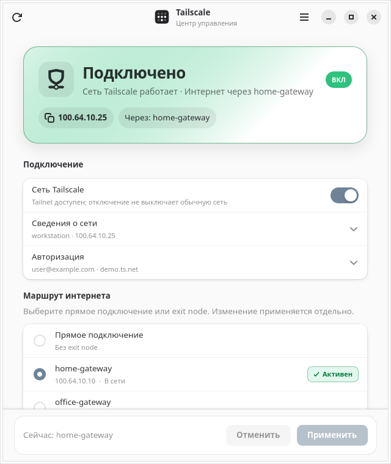
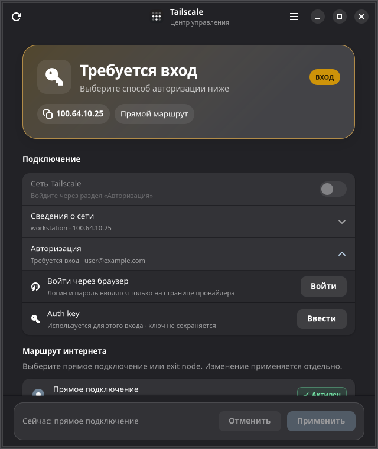

<p align="center">
  
</p>

# Tailscale Toggle

[](https://github.com/VladislavKve/tailscale-toggle/actions/workflows/ci.yml)

An unofficial GTK 4 / Libadwaita desktop controller for Tailscale on Ubuntu and
GNOME. It provides a compact connection dashboard, exit-node selection, a tray
indicator, browser sign-in, and a carefully isolated auth-key flow.

> This is a community project. It is not affiliated with or endorsed by
> Tailscale Inc.

The application interface is currently in Russian; contributions for a full
English localization are welcome.

[Русская версия](README.ru.md)

<p align="center">
  
  
</p>

## Features

- Clear connected, stopped, sign-in, approval, degraded, and error states.
- Direct route and exit-node selection with online/offline status and search.
- Browser-based identity-provider sign-in; credentials never enter this app.
- Masked `tskey-auth-` input that is never stored or placed directly in argv.
- Safe return to the previous local Tailscale profile after an interrupted login.
- GNOME light/dark/system themes and a GTK 3 Ayatana AppIndicator tray helper.
- Non-blocking status refresh, single-window activation, and defensive error UI.

## Requirements

- Ubuntu 24.04 or newer with a GNOME desktop session.
- [Tailscale installed](https://tailscale.com/docs/install/linux).
- Python 3, GTK 4, Libadwaita, and PyGObject.

Install the required GUI packages:

```bash
sudo apt update
sudo apt install python3 python3-gi gir1.2-gtk-4.0 gir1.2-adw-1 policykit-1
```

For the optional tray indicator:

```bash
sudo apt install gir1.2-gtk-3.0 gir1.2-ayatanaappindicator3-0.1 \
  gnome-shell-extension-appindicator
```

## Install

```bash
git clone https://github.com/VladislavKve/tailscale-toggle.git
cd tailscale-toggle
./install.sh
```

The installer is user-scoped and does not modify Tailscale configuration. It
copies the application to `~/.local/share/tailscale-toggle`, installs a GNOME
launcher and icon, and creates `~/.local/bin/tailscale-toggle`.

Launch **Tailscale Toggle** from GNOME or run:

```bash
tailscale-toggle
```

If `~/.local/bin` is not in `PATH`, run the installed launcher directly:

```bash
~/.local/bin/tailscale-toggle
```

## Update and uninstall

```bash
cd tailscale-toggle
git pull --ff-only
./install.sh
```

```bash
~/.local/share/tailscale-toggle/uninstall.sh
```

Add `--purge` to the uninstall command only if you also want to remove the
small preferences file under `~/.config/tailscale-toggle`.

## Authentication and security

- Passwords, MFA codes, and passkeys are entered only on the identity
  provider's page opened through `https://login.tailscale.com`.
- Auth keys are accepted only with the case-sensitive `tskey-auth-` prefix.
- The key is passed to the CLI through a mode-`0600` file in the private runtime
  directory, redacted from errors, and removed on every exit path.
- The app asks PolicyKit for elevated access only after the local Tailscale CLI
  reports that the requested operation needs it.
- Account changes are explicit because `tailscale login` immediately switches
  away from the current local profile. The previous opaque profile ID is kept
  only in memory so the user can return safely.

Please report security issues through a
[private GitHub security advisory](https://github.com/VladislavKve/tailscale-toggle/security/advisories/new),
not a public issue.

## Development

Run directly from the checkout:

```bash
./run.sh
```

Open a safe mock state without invoking the Tailscale CLI or tray:

```bash
./run.sh --preview connected --no-tray
./run.sh --preview needs-login --no-tray
```

Run the test suite:

```bash
/usr/bin/python3 -B -m unittest discover -s tests -v
```

See [CONTRIBUTING.md](CONTRIBUTING.md) for contribution guidelines.

## License and trademarks

Source code is distributed under the license in [LICENSE](LICENSE). Tailscale,
its name, and its logo are trademarks of Tailscale Inc. See [NOTICE.md](NOTICE.md)
for asset attribution and the project disclaimer.
